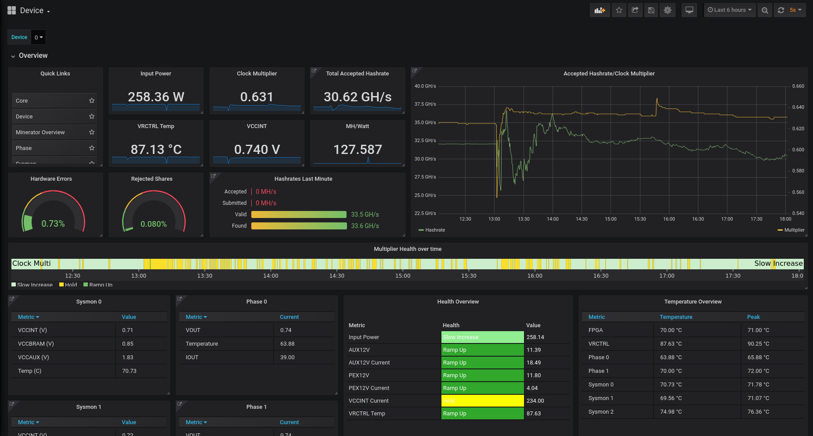
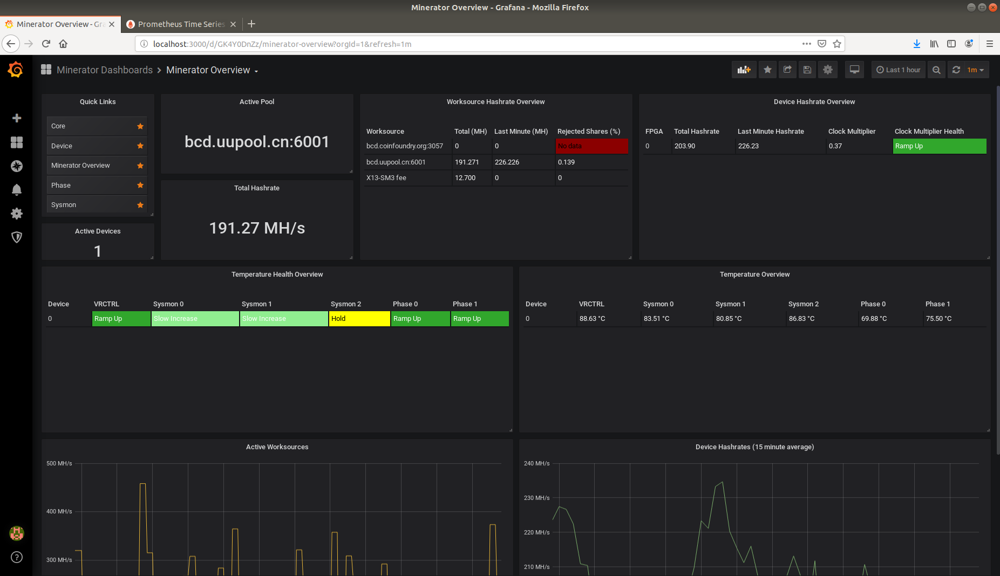

# minerator-metrics

Visualisations for Minerator using Prometheus/Grafana.

# Screenshots

Device Dashboard


Overview Dashboard


# Quick Setup for Ubuntu 18.04 rigs running minerator

Quick setup for running on Ubuntu 18.04 rigs running minerator:
```
sudo apt-get install git
git clone https://github.com/pigfrown/minerator-metrics
cd minerator-metrics
sudo su
./setup.sh
```

If you can't access grafana remotely you need to also run ```./setup_network.sh``` (as root). 
This script will enable and configure the ubuntu firewall to allow remote connections to grafana/prometheus.

Note: this will automatically start prometheus/grafana/minerator-metrics on boot.
disable the relevant systemd services if you don't want this (see script).

For other systems, check the scripts to see what needs installing/configuring.

If you want to run prometheus/grafana on a seperate server you need to manually install prometheus and grafana and edit prometheus.yml to point to your minerator rig(s). minerator-metrics.py needs to be run on each minerator rig.


## Confirm Prometheus Installed

Prometheus is only available from the minerator system.

Goto localhost:9090 from your minerator system. You should see Prometheus web interface.
Go to Status->Targets and you should see "minerator" target, and it should be up.

## Grafana Configuration

Grafana should be up on port 3000 on your minerator box. 

Access grafana and log in with default username "admin", password "admin" and change your password.

### Add Prometheus Datasource

* Click "Add data source", select "Prometheus".
* set URL to "http://localhost:9090".
* Ensure name is "local_prometheus".
* Click "Save and Test" and Prometheus should be configured with grafana

Alternativly you can use the setup_grafana.sh script to create ths datasource.

### Import Dashboards

* On the left hand side of Grafana, click the "+" symbol
* Select Import Dashboard
* make sure you select the prometheus data source that was created earlier
* Click "Upload .json File" and select Device.json from minerator-metrics/dashboards
* Repeat process for Core, Phase, Sysmon, and MineratorOverview dashboards

# Setup for other systems

Check the scripts to see what needs installing/configuring.

If you want to run prometheus/grafana on a seperate server you need to manually install prometheus and grafana and edit prometheus.yml to point to your minerator rig(s). minerator-metrics.py needs to be run on each minerator rig.


# Multiple rigs

No dashboard for this, but metrics have a "rig" label that could be used to create one.


# Troubleshooting 

Check prometheus, grafana-server, and minerator-metrics systemd services are all running.
Check logs (journalctl -u) for the above services


